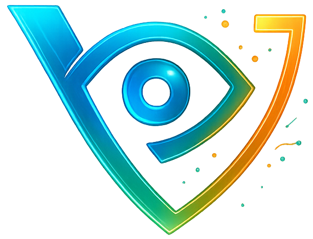
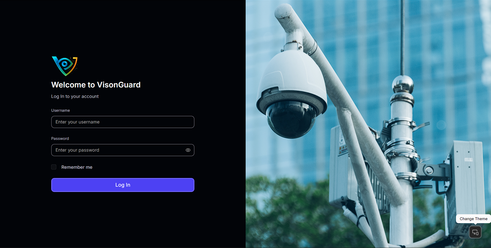
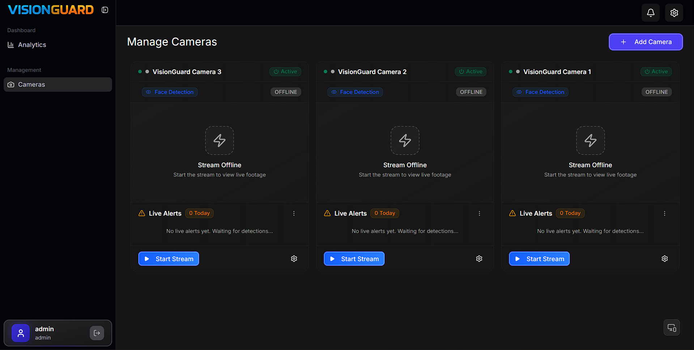
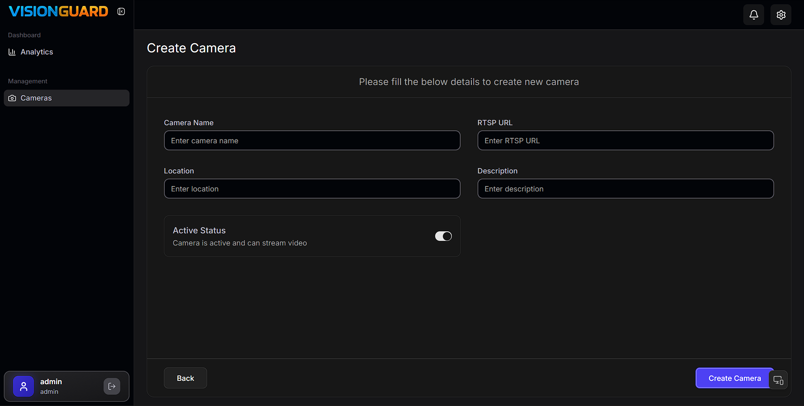
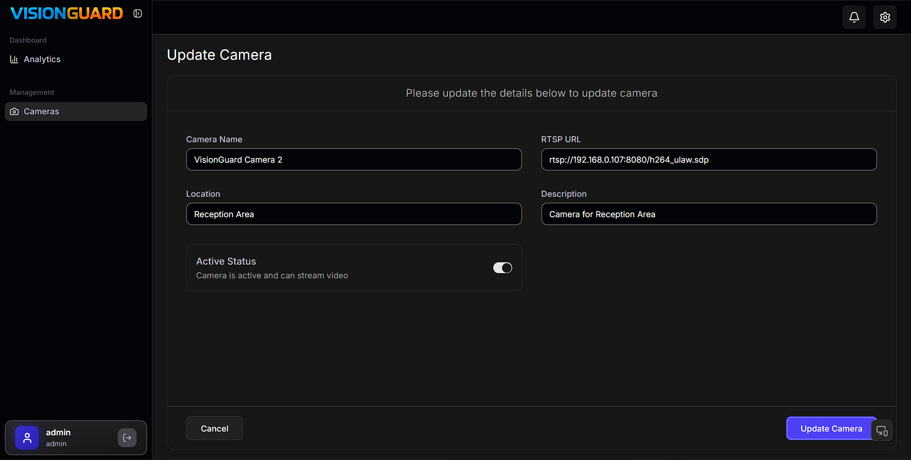
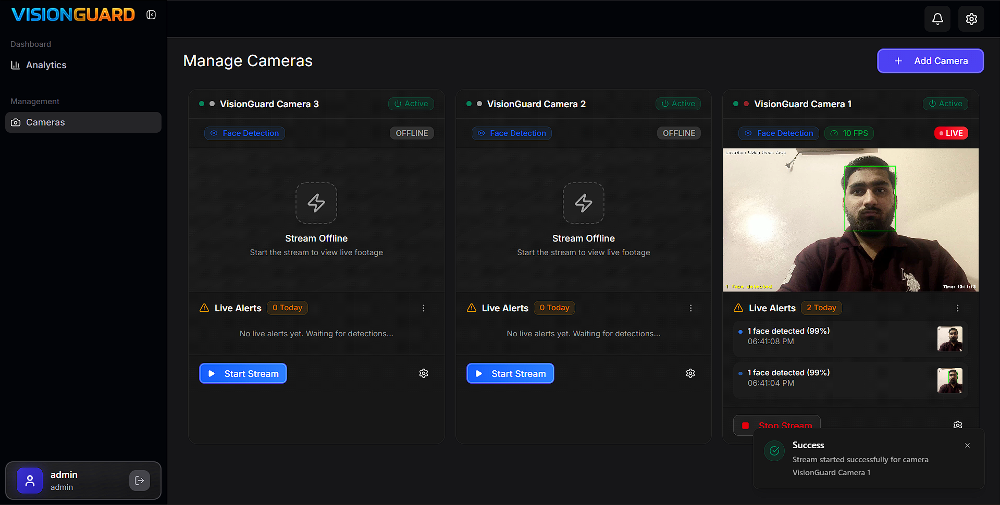
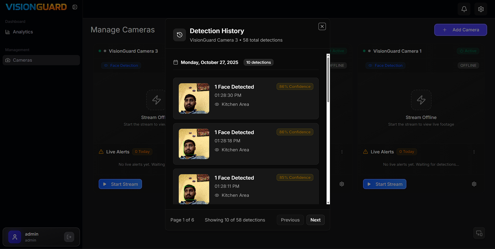
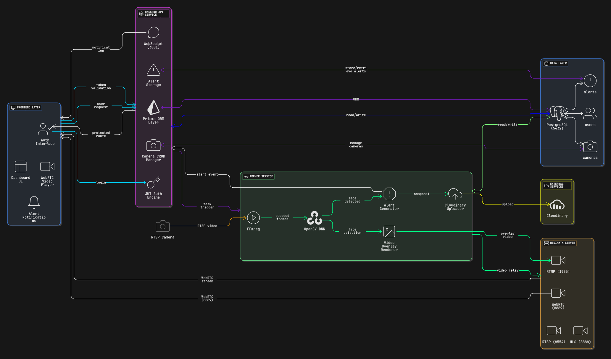
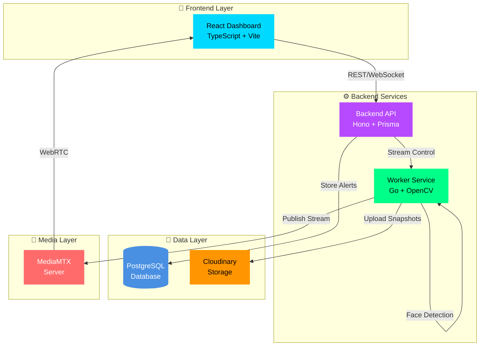

<div align="center">

<div style="display: inline-flex; flex-direction: row; align-items: center; justify-content: center; gap: 20px;">
  
  <h1 style="font-size: 4em; font-weight: bold; margin: 0; line-height: 1;">VisionGuard</h1>
</div>

### Real-Time Multi-Camera Face Detection Dashboard

**Production-ready microservices platform for intelligent surveillance**

[](LICENSE)
[](https://www.typescriptlang.org/)
[](https://golang.org/)
[](https://reactjs.org/)
[](https://opencv.org/)
[](https://www.docker.com/)

[📹 Watch Demo](#-demo--screenshots) • [🚀 Quick Start](#🚀-quick-start) • [📖 API Docs](#📡-api-reference) • [💬 Support](#-support)




</div>

---

## 📋 Table of Contents

- [🎯 Overview](#-overview)
- [📹 Demo & Screenshots](#-demo--screenshots)
- [🏗️ System Architecture](#️-system-architecture)
- [🚀 Features](#-features)
- [🛠️ Tech Stack](#️-tech-stack)
- [🚀 Quick Start](#🚀-quick-start)
- [📡 API Reference](#📡-api-reference)
- [⚠️ Known Limitations](#️-known-limitations)
- [🔮 Future Roadmap](#-future-roadmap)
- [🤝 Contributing](#-contributing)
- [📄 License](#-license)
- [👨‍💻 Author](#️-author)
- [💬 Support](#-support)

---

## 🎯 Overview

VisionGuard is a real-time surveillance system that transforms IP cameras into intelligent security monitors. It demonstrates microservices architecture with real-time video processing.

### ✨ What Makes It Special?

- 🎥 **Multi-Camera Support** - Manage and monitor up to 4 concurrent camera streams
- 🧠 **AI-Powered Detection** - Real-time face detection using OpenCV DNN (ResNet-10 SSD)
- ⚡ **Sub-Second Latency** - WebRTC streaming for near-instantaneous video delivery
- 🔔 **Instant Alerts** - Real-time notifications via WebSocket when faces are detected
- ☁️ **Cloud Storage** - Automatic snapshot upload to Cloudinary
- 🎛️ **Live Controls** - Adjust FPS, toggle detection, all in real-time

### 🎬 Demo Credentials

- Username: `admin`
- Password: `admin@123`

---

## 📹 Demo & Screenshots

<div align="center">

### 🎥 Video Walkthrough

[](https://youtu.be/your-video-link)

**[⬇️ Download Full Video](link-to-video.mp4)** | **Duration:** 8 minutes

---

### 📸 Screenshots

#### 🔐 Authentication Page


#### 📊 Main Dashboard


#### 📹 Add Camera



#### 🎛️ Camera Controls


#### ⚙️ Edit Camera



#### 🎯 Live Face Detection



#### 📈 Detection History



</div>

---

## 🏗️ System Architecture

### Architecture Diagram

<div align="center">



</div>

### System Components



### 🔄 Request Flows

<details>
<summary><b>📹 Stream Start Flow</b></summary>

```
User clicks "Start Stream"
    ↓
Frontend sends POST /api/v1/cameras/start-stream/:id
    ↓
Backend validates & forwards to Worker
    ↓
Worker starts FFmpeg ingestion from RTSP
    ↓
OpenCV processes frames for face detection
    ↓
FFmpeg encodes with overlays to RTMP
    ↓
MediaMTX receives and converts to WebRTC
    ↓
Browser displays live video with bounding boxes
```

</details>

<details>
<summary><b>🚨 Alert Flow</b></summary>

```
Face detected by OpenCV DNN
    ↓
Worker captures snapshot frame
    ↓
Upload to Cloudinary (async)
    ↓
POST alert to Backend API
    ↓
Backend stores in PostgreSQL
    ↓
WebSocket broadcasts to subscribed clients
    ↓
Frontend shows real-time notification
```

</details>

---

## 🚀 Features

<div align="center">

### ✨ Core Features

</div>

#### 📹 Camera Management

<div style="background: #1a1a1a; padding: 15px; border-radius: 10px; margin: 12px 0; border: 1px solid #333; color: #e0e0e0;">
Complete CRUD operations with intuitive interface, enable/disable individual cameras, RTSP URL validation, and rich location metadata.
</div>

#### ⚡ Real-Time Streaming

<div style="background: #1a1a1a; padding: 15px; border-radius: 10px; margin: 12px 0; border: 1px solid #333; color: #e0e0e0;">
WebRTC technology for sub-second latency, multi-protocol support (HLS, RTSP, RTMP), scalable architecture supporting 4 concurrent streams with automatic quality adaptation.
</div>

#### 🧠 AI Face Detection

<div style="background: #1a1a1a; padding: 15px; border-radius: 10px; margin: 12px 0; border: 1px solid #333; color: #e0e0e0;">
OpenCV DNN with ResNet-10 SSD model, 85%+ confidence threshold for reliable detections, real-time bounding boxes with smooth overlays, and toggle detection on/off per camera.
</div>

#### 🔔 Alert System

<div style="background: #1a1a1a; padding: 15px; border-radius: 10px; margin: 12px 0; border: 1px solid #333; color: #e0e0e0;">
Instant WebSocket notifications, automatic Cloudinary snapshot storage, paginated alert history with advanced filtering, and camera-specific alert management.
</div>

#### 🛡️ Security

<div style="background: #1a1a1a; padding: 15px; border-radius: 10px; margin: 12px 0; border: 1px solid #333; color: #e0e0e0;">
JWT authentication with secure token management, protected API endpoints, worker service API key authentication, and role-based access control (RBAC) ready.
</div>

<div align="center">

### ✨ Bonus Features

</div>

#### ⚡ Performance

<div style="background: #1a1a1a; padding: 15px; border-radius: 10px; margin: 12px 0; border: 1px solid #333; color: #e0e0e0;">
Dynamic FPS control (1-60), smart frame skipping for real-time processing, efficient connection pooling, and exponential backoff retry mechanism.
</div>

#### 🎨 User Experience

<div style="background: #1a1a1a; padding: 15px; border-radius: 10px; margin: 12px 0; border: 1px solid #333; color: #e0e0e0;">
Responsive Shadcn-UI design, dark/light theme support, Progressive Web App (PWA) capabilities, and comprehensive stream health monitoring.
</div>

#### 🔧 Developer Tools

<div style="background: #1a1a1a; padding: 15px; border-radius: 10px; margin: 12px 0; border: 1px solid #333; color: #e0e0e0;">
Interactive Swagger API documentation, complete Docker Compose setup, comprehensive logging with structured format, and health check endpoints.
</div>

---

## 🛠️ Tech Stack

<div align="center">

### Frontend


### Backend


### Worker


### Infrastructure


</div>


## 🚀 Quick Start

### 📦 Prerequisites

Before you begin, ensure you have:

- **Docker** `24.0+` with Docker Compose V2
- **Node.js** `20+` (for local development)
- **Go** `1.23+` (for worker development)
- **PostgreSQL** `16+` (optional, if not using Docker)

### External Services

1. **Cloudinary Account** (Required for snapshots)

   - Sign up at [cloudinary.com](https://cloudinary.com)
   - Get your Cloud Name, API Key, and API Secret

2. **RTSP Camera** (For testing)
   - Install an IP-webcam app on your phone or use a dedicated IP camera
   - Or test with [MediaMTX RTSP simulator](https://github.com/bluenviron/mediamtx)

### Docker Setup (Recommended)

```bash
# 1. Clone repository
git clone https://github.com/adeshg09/visionguard-realtime-multi-camera-face-detection
cd visionguard-realtime-multi-camera-face-detection

# 2. Configure environment variables
cd infra-service

# Copy and configure environment files
cp .env.example .env
cp env/frontend.env.example env/frontend.env
cp env/backend.env.example env/backend.env
cp env/worker.env.example env/worker.env

# Edit all .env files with your actual credentials:
# - Update Cloudinary credentials in worker.env
# - Set database URLs and API keys
# - Configure JWT secrets and other settings

# 3. Build and start all services
docker-compose up -d --build

# 4. Check services health
curl http://localhost:3000/api/v1/health  # Backend
curl http://localhost:5000/health         # Worker
curl http://localhost:9997/v3/config/get  # MediaMTX

# 5. Access the application
echo "🎉 VisionGuard is running!"
echo "Frontend Service: http://localhost:5173"
echo "Backend Service: http://localhost:3000"
echo "Worker Service: http://localhost:5000"
echo "API Documentation: http://localhost:3000/api-docs"
echo "MediaMTX Console: http://localhost:9997"

```

## 📡 API Reference

**📚 Full API Documentation:** Available in Swagger at `http://localhost:3000/api-docs`

---

## ⚠️ Known Limitations

| Limitation               | Description                                                                                | Impact                                                                                                         |
| ------------------------ | ------------------------------------------------------------------------------------------ | -------------------------------------------------------------------------------------------------------------- |
| **Concurrent Streams**   | Maximum 4 simultaneous active streams due to CPU/memory constraints                        | Configurable via `OPTIMAL_STREAM_CAPACITY` environment variable; can be increased with more powerful hardware  |
| **Face Detection Model** | ResNet-10 SSD provides ~80-90% accuracy; may miss faces at extreme angles or poor lighting | Model can be replaced with more accurate alternatives (e.g., YOLOv8, RetinaFace) in `face_detection_engine.go` |
| **Cloud Dependency**     | Requires Cloudinary account for snapshot storage; no local filesystem fallback             | Can be extended to support local storage by modifying `alert_service.go `                                      |
| **RTSP Compatibility**   | Some cameras require specific FFmpeg flags for codec compatibility                         | Add custom flags in `ffmpeg_operations.go` for specific camera models                                          |
| **WebRTC NAT Traversal** | Direct WebRTC connection may fail behind complex NAT/firewalls                             | TURN server can be configured in MediaMTX for NAT traversal                                                    |
| **Memory Usage**         | Each active stream consumes 200-400MB RAM depending on resolution                          | Use lower resolution cameras or increase available RAM                                                         |
| **No Recording**         | Live streams only; no video recording to disk functionality                                | Feature can be added by capturing RTMP stream to disk via FFmpeg                                               |

---

## 🔮 Future Roadmap

### High Priority

- [ ] **Recording System** - Continuous recording to disk with configurable retention policies, video playback interface with timeline scrubbing and speed controls, support for exporting specific time ranges or alert-triggered clips
- [ ] **Multi-User Support** - Enhanced user management with organization/group hierarchy, granular permissions per camera and feature, activity audit logs for compliance and security
- [ ] **Face Recognition** - Person identification and tracking across cameras, face database with name labeling and search, alert filtering by known/unknown persons
- [ ] **Mobile Apps** - Native iOS application with push notifications, native Android application with background streaming, mobile-optimized live view and alert management
- [ ] **Email/SMS Alerts** - Email alert delivery with snapshot attachments, SMS/WhatsApp notifications via Twilio integration, webhook support for custom integrations, alert escalation rules and scheduling

### Medium Priority

- [ ] **GPU Acceleration** - CUDA/OpenCL support for faster face detection, distributed worker architecture for handling 20+ concurrent streams, load balancing across multiple worker instances, Redis caching for frequently accessed data
- [ ] **Object Detection** - Detect people, vehicles, animals, packages; AI-powered anomaly detection and behavior analysis, integration with external security systems
- [ ] **Zone Management** - Define custom detection zones per camera, zone-specific alert rules and sensitivity levels, cross-zone tracking for movement patterns
- [ ] **Analytics Dashboard** - Interactive analytics dashboard with charts and graphs, people counting and dwell time analysis, heat maps showing high-traffic areas, custom report generation and scheduled exports
- [ ] **Advanced Playback** - Timeline scrubbing, speed control, thumbnails, export functionality for evidence management

### Low Priority

- [ ] **ONVIF Support** - Auto-discovery of IP cameras, camera health monitoring and diagnostics, automatic camera configuration and optimization
- [ ] **PTZ Control** - Pan/Tilt/Zoom camera control interface, preset position management, patrol patterns
- [ ] **Audio Streaming** - Add audio to video feeds, two-way audio communication, audio event detection
- [ ] **Internationalization** - Multi-language support (i18n) for global deployment, locale-specific date/time formats
- [ ] **Webhook Integration** - Custom webhook triggers for external system integration, API extensibility for custom workflows

---

## 🤝 Contributing

Contributions are welcome! Please feel free to submit a Pull Request.

1. Fork the repository
2. Create your feature branch (`git checkout -b feature/AmazingFeature`)
3. Commit your changes (`git commit -m 'Add some AmazingFeature'`)
4. Push to the branch (`git push origin feature/AmazingFeature`)
5. Open a Pull Request

---

## 📄 License

This project is licensed under the MIT License - see the [LICENSE](LICENSE) file for details.

---

## 👨‍💻 Author

<div align="center">

### **Adesh Gadage**

_Full Stack Developer_

<div style="display: flex; justify-content: center; gap: 15px; margin: 20px 0;">

[](https://github.com/adeshg09)
[](https://www.linkedin.com/in/adesh09)
[](https://adeshgadage.builtbyag09.tech/)

</div>

</div>

## 💬 Support

Need help? Have questions?

- 📫 Email: adeshgadage09@gmail.com
- 🐛 Issues: [GitHub Issues](https://github.com/yourusername/visionguard/issues)
- 📖 Documentation: Check the [API docs](http://localhost:3000/api-docs)

---
